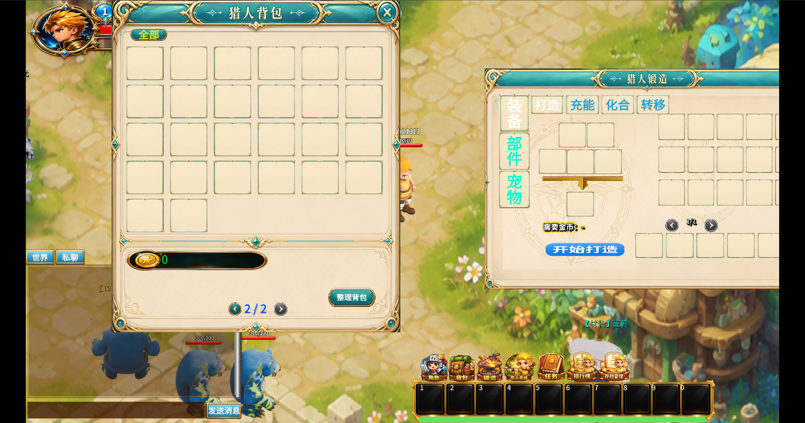
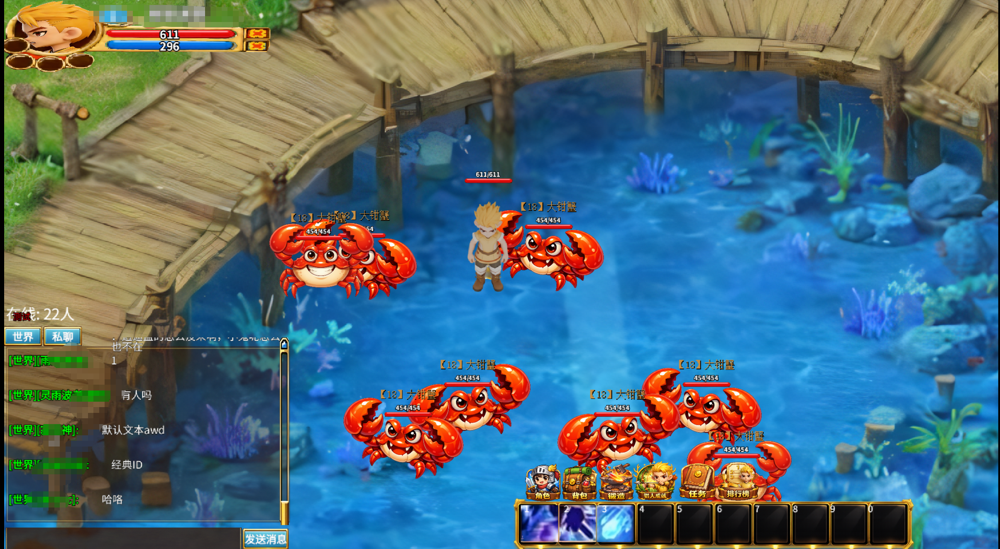
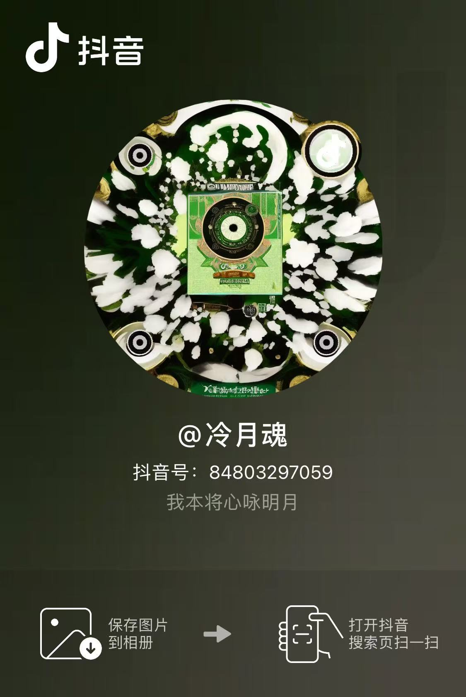
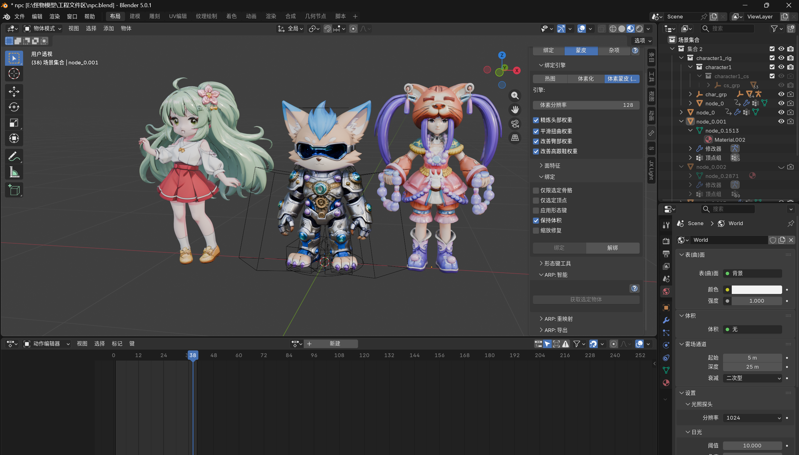

# Monster Kingdom

<p align="center">
  
  
  
</p>

> Dedicated to all children who left their memories in Monster World. I intended to sing to the bright moon, but the moon shines on the evil dragon.

[English](README.md) | [简体中文](README_zh_CN.md)

---

## I. A Message From the Heart

Do you remember that summer afternoon in elementary school, when you first clicked on the 4399 icon and rushed into Rainbow Forest of Monster World? Following Smarty Pig to defeat your first Naughty Pig, saving up materials for so long, finally crafting that long-awaited various sets. On the way to school, thinking about having enough money to buy a Crocodile Set. Looking at the stats on the panel, believing this world would always be here waiting for us to explore, waiting for us to defeat all monsters, waiting for us to dominate in Thorn Island.

All these years have passed. We've grown from elementary school kids to working adults, with new lives, new friends, but there's still a place in our hearts reserved for that Rainbow Forest, for the story that started with a Naughty Pig, a Mischievous Monkey, and a Kabibear.

Now, the Moon Chanting Continent is being rebuilt, named **Monster Kingdom**. This is not a commercial game. Player game data is stored entirely locally, just a nostalgic experience for old players, no payments, just wanting those of us who miss it to return to that world, wear our old sets, fight Sawtooth Sharks again, explore Rainbow Forest again, and finally complete the unfinished dreams of the Tower of Dreams.

In 2025, I heard there were some small conflicts between the remake author and the Little Hunters. Those who used to steal accounts and scam accounts are back today in a new form, using the name of Monster World to scam money and exploit nostalgia (if you can reach the Imperial Capital, **you will see him being punished by Saiwen to water the Miracle Tree**). I don't like self-deception, and this year I don't want it to disappear again. So I open-sourced it, so that others can continue. This world will always be here, **never shutting down again**. If you're interested, feel free to contact me and join building the Moon Chanting Continent together.

---

## II. Project Introduction

Monster Kingdom is a nostalgic open-source recreation of the classic 4399 web game "Monster World", created to preserve childhood memories for returning players. Game data is stored entirely locally with no payment entry or paid items. Wings and pets will be in the future Miao Crystal Mall, obtainable through activities like Desert Gold Rush, Miao Qianxun, Mystery Winged, Naughty Pig Battle, etc. The Flame Hall gameplay has been implemented.





### Core Features

- **Real-time Battle System** - Smooth ARPG combat experience
- **Multi-Controller Support** - Keyboard, Mouse, Gamepad
- **Plugin System** - Quests, Achievements, Forging, Reputation, etc.

Video content available on Douyin:



### Open Source Content

This project is fully open-source, including:

| Module | Description | Status |
|--------|-------------|--------|
| Game Client | TypeScript source code | ✅ Open Source |
| Game Resources | Assets, config files | ✅ Open Source |
| Documentation | Technical documentation | ✅ Open Source |

### Technical Architecture

| Category | Technology | Description |
|----------|-----------|-------------|
| Game Engine | GameCreator | Core game engine |
| Client | TypeScript | Game logic development |

---

## III. Game World Restoration

### Classic Maps

#### Lotus Village (Beginner Zone)
- Starting area for new players
- NPCs: 【Scout】Iron Dark, 【Scout】Iron Light, 【Moon Chanting Guide】Sister Hua, 【Reward Ambassador】Ah Chun, 【Blacksmith】Silver Forge
- Monsters: 【12】Captive Stick Bear, 【8】Captive Mischievous Monkey

#### Rainbow Forest
- Beginner leveling area
- Monsters: Naughty Pig, Mischievous Monkey
- Activity: Naughty Pig Battle (waiting)

#### Rainbow Village
- Coastal fishing village
- Monsters: White Shark, Amphibious Fishman, Fishman Captain, White Shark Captain (waiting)
- Dungeon: Sawtooth Shark (optimizing)
- Activity: Stone Whale Prison (waiting)

#### Star Hunting City (In Development)
- Main city
- Features: Stall Market, Auction House, Caravan Escort
- NPCs: King, Chamber of Commerce President, Arena Manager

### Project Structure

```
gsgd-open/
├── Game/                      # Game Client
│   ├── game/                  # Main Game Logic
│   │   ├── GCMain.ts         # Game Entry Point
│   │   ├── GameGate.ts       # Scene Controller
│   │   └── project/          # Project Modules
│   │       ├── battle/       # Battle System
│   │       ├── controller/   # Input Control
│   │       ├── scene/        # Scene System
│   │       ├── ui/           # UI System
│   │       └── utils/        # Utilities
│   └── system/               # System Modules
│       ├── 锻造代码/         # Forging System
│       └── 副本/             # Dungeon System
├── asset/                    # Game Resources
│   ├── audio/                # Audio Assets
│   ├── image/                # Image Assets
│   ├── json/                 # UI Configs
│   └── language/             # Language Packs
├── 建模/                     # 3D Model Resources
│   ├── 铁匠.glb             # Blacksmith NPC Model
│   ├── 守卫.glb             # Guard NPC Model
│   ├── 新手阿春.glb         # Beginner Guide NPC Model
│   └── 花花.glb             # HuaHua NPC Model
```

---

## IV. Module Details

### 4.1 Core Modules

#### Game Entry (GCMain)

```typescript
let Game: ProjectGame = new ProjectGame();
GameGate.start();
```

#### Scene Controller (GameGate)

Manages game scene switching and save loading.

| State | Description |
|-------|-------------|
| `STATE_0` | Leave scene |
| `STATE_1` | Load scene |
| `STATE_2` | Execute enter event |
| `STATE_3` | Scene complete |
| `STATE_4` | Player controllable |

#### Battle System (GameBattle)

Core battle flow control, refreshes every 6 frames.

### 4.2 UI System

| Interface | File | Function |
|-----------|------|----------|
| Main | `GUI_Main.ts` | Status bar, quick actions |
| Skills | `GUI_Skill.ts` | Skill list, details |
| Bag | `GUI_Bag.ts` | Item management |
| Actor | `GUI_Actor.ts` | Attribute view |
| Quest | `Lmkrt_GUI_Mission.ts` | Quest tracking |
| Achievement | `Lmkrt_GUI_Achievement.ts` | Achievement unlock |
| Reputation | `Lmkrt_GUI_Favor.ts` | NPC reputation |
| Forging | `Crafting_system.ts.ts` | Equipment enhancement |

---

## V. Quick Start

### Requirements

- Node.js >= 16

### Installation

```bash
# Clone project
git clone https://github.com/worddream666/gsgd666.git
cd gsgd666

# Install dependencies
npm install
```

### Development

```bash
# Development mode (watch compilation)
npm run watch

# Build project
npm run build
```

### Deployment

1. Build: `npm run build`
2. Deploy `Game/dist/` to web server

---

## VI. Copyright Notice & Disclaimer

### 6.1 Project Nature Statement

⚠️ **Important Notice**: This project is an open-source project for **learning, communication, and code demonstration**. The purpose of this project is:

- 🎓 **Learning & Communication**: For game development enthusiasts to learn 2D ARPG game development techniques
- 💡 **Code Demonstration**: Demonstrating game development practices with GameCreator engine
- 🎮 **Nostalgic Preservation**: Recreating classic game code implementations for old players to reminisce

### 6.2 Disclaimer

⚠️ **Important**: This project **does not guarantee** that every user can successfully run and deploy the development environment! The **intention is to learn game operation, crafting, charging, combining, transferring, and Flame Hall flame pillar refresh/damage logic for educational purposes, NOT to help anyone set up private servers.**

### 6.3 Copyright Attribution

1. This project is a **non-commercial nostalgic project** created solely for preserving childhood memories. No commercial use is intended.
2. All original game assets, story content, and world settings are copyrighted by **Ninja Cat Studio** and **4399 Network Co., Ltd.**
3. All code is fully open under the **MIT License**, only for learning, communication, and nostalgic preservation. Please delete within 24 hours.

---

## VII. Acknowledgments

- [GameCreator](https://www.gamecreator.com/) - Game engine
- All players who left memories in Monster World
- All Little Hunters who haven't joined the Moon Chanting Continent yet, welcome to rebuild together


---

<p align="center">
  <i>Dedicated to all children who once left their memories in that world</i>
</p>
