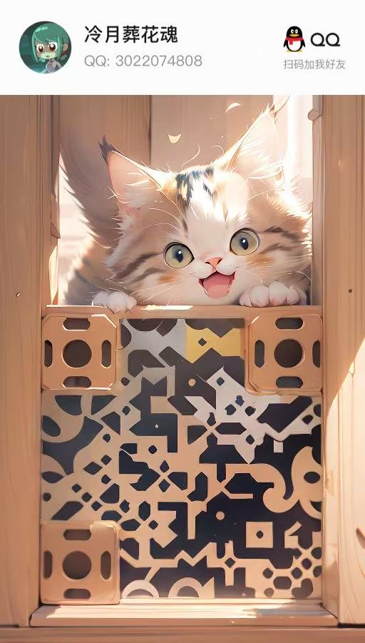

# 怪兽国度 - Monster Kingdom

<p align="center">
  
  
  
</p>

> 献给所有曾经在怪物世界里留下回忆的孩子们，我本将心咏明月，奈何明月照邪龙

[English](README.md) | [简体中文](README_zh_CN.md)

---

## 一、写在前面

还记得小学的那个夏天，第一次点开 4399 里的图标，冲进怪物世界的彩虹森林，跟着聪聪猪一起打第一个淘气猪。那时候攒了好久的材料，一点点锻造，终于做出了心心念念的各种套装，以前上学路上还想着自己马上就有钱能买套鳄鱼装。看着面板上的数值，以为这个世界会一直在这里，等我们慢慢探索，等我们打完所有的怪物，等我们在荆棘岛称王称霸。

这么多年过去，我们从小学的孩子，变成了上班的大人，有了新的生活，新的朋友，可心里总还有一块地方，留着那个彩虹森林，留着从一只淘气猪、一只顽皮猴、一只卡比熊开始的故事。

现在，月咏大陆正在重建，取名叫 **怪兽国度**。这不是什么商业游戏，玩家游戏数据纯本地存储，只是一个给老玩家的公益体验，没有充值，只是想让我们这些想念它的人，能重新回到那个世界，穿上当年的套装，再打一次锯齿鲨，再逛一次彩虹森林，把当年梦之塔没做完的梦，做完。

这份小猎人们共同的回忆，在25年听说复刻作者与小猎人们之间有些小插曲，当年洗号、盗号的那些人在今天重建过程中又以新的形式打着怪物世界的名义圈钱、骗情怀（如果能做到帝都，**你们会看到他被赛文惩罚负责给奇迹之树浇水**）。我不喜欢自欺欺人**，今年我不想让它再消失了。所以我把它开源了，因为可以让别人接着做，这个世界，就会一直在这里，**永远不会再关服了。如果你也对他感兴趣欢迎联系我，共同建设月咏大陆。

---

## 二、项目开源介绍

怪兽国度 (Monster Kingdom) 本项目是对 **4399 经典页游《怪物世界》** 的怀旧开源复刻，旨在让老玩家能够重温当年的游戏回忆，游戏数据全面本地存储，没有任何充值入口和付费道具，翅膀、宠物都在未来的喵晶商城里面，靠大漠淘金、喵千寻、神秘翼人、淘气猪大作战等活动获取，目前已实现火焰大厅玩法复刻。


### 核心特性

- **即时战斗系统** - 流畅的 ARPG 战斗体验

- **多控制器支持** - 键盘、鼠标、游戏手柄

- **丰富插件系统** - 任务、成就、锻造、好感度等

  视频相关资料请前往抖音：

  

### 开源内容

| 模块 | 说明 | 状态 |
|------|------|------|
| 游戏客户端 | TypeScript 源代码 | ✅ 开源 |
| 游戏资源 | 素材、配置文件 | ✅ 开源 |
| 开发文档 | 技术文档 | ✅ 开源 |

### 技术架构

| 分类 | 技术 | 说明 |
|------|------|------|
| 游戏引擎 | GameCreator | 核心游戏引擎 |
| 客户端 | TypeScript | 游戏逻辑开发 |

---

## 二、游戏场景还原

### 经典地图

#### 莲花村（新手村）
- 新手出生地
- NPC：【侦查】铁暗、【侦查】铁光、【月咏大陆引路人】花姐姐、【奖励大使】阿春、【铁匠】银冶
- 怪物：【12】圈养的木棍熊、【8】圈养的顽皮猴

#### 彩虹森林
- 新手练级区域
- 怪物：淘气猪、顽皮猴
- 活动：淘气猪大作战（waiting）

#### 彩虹村
- 海边渔村
- 怪物：小白鲨、两栖鱼人、鱼人队长、小白鲨队长（waiting）
- 副本：锯齿鲨（优化ing）
- 活动：石鲸大牢（waiting）

#### 星狩城（正在制作中）
- 主城
- 功能：摆摊、拍卖行、押送商车
- NPC：国王、商会会长、竞技场管理员

### 项目结构

```
gsgd-open/
├── Game/                      # 游戏客户端
│   ├── game/                  # 游戏主逻辑
│   │   ├── GCMain.ts         # 游戏入口
│   │   ├── GameGate.ts       # 场景控制器
│   │   └── project/          # 项目模块
│   │       ├── battle/       # 战斗系统
│   │       ├── controller/   # 输入控制
│   │       ├── scene/        # 场景系统
│   │       ├── ui/           # 界面系统
│   │       └── utils/        # 工具函数
│   └── system/               # 系统模块
│       ├── 锻造代码/         # 锻造系统
│       └── 副本/             # 副本系统
├── asset/                    # 游戏资源
│   ├── audio/                # 音频资源
│   ├── image/                # 图片素材
│   ├── json/                 # UI 配置
│   └── language/             # 语言包
├── 建模/                     # 3D 模型资源
│   ├── 铁匠.glb             # 铁匠 NPC 模型
│   ├── 守卫.glb             # 守卫 NPC 模型
│   ├── 新手阿春.glb         # 新手引导 NPC 模型
│   └── 花花.glb             # 花花 NPC 模型
```

---

## 三、模块详解

### 3.1 核心模块

#### 游戏入口 (GCMain)

```typescript
let Game: ProjectGame = new ProjectGame();
GameGate.start();
```

#### 场景控制器 (GameGate)

管理游戏场景切换、存档读取。

| 状态 | 说明 |
|------|------|
| `STATE_0` | 离开场景 |
| `STATE_1` | 加载场景 |
| `STATE_2` | 执行进入事件 |
| `STATE_3` | 场景完成 |
| `STATE_4` | 玩家可控制 |

#### 战斗系统 (GameBattle)

核心战斗流程控制，每 6 帧刷新一次。

### 3.2 UI 界面系统

| 界面 | 文件 | 功能 |
|------|------|------|
| 主界面 | `GUI_Main.ts` | 状态栏、快捷操作 |
| 技能 | `GUI_Skill.ts` | 技能列表、详情 |
| 背包 | `GUI_Bag.ts` | 物品管理 |
| 角色 | `GUI_Actor.ts` | 属性查看 |
| 任务 | `Lmkrt_GUI_Mission.ts` | 任务追踪 |
| 成就 | `Lmkrt_GUI_Achievement.ts` | 成就解锁 |
| 好感度 | `Lmkrt_GUI_Favor.ts` | NPC 好感度 |
| 锻造 | `Crafting_system.ts.ts` | 装备强化 |

---

## 四、快速开始

### 环境要求

- Node.js >= 16

### 安装

```bash
# 克隆项目
git clone https://github.com/worddream666/gsgd666.git
cd gsgd666

# 安装依赖
npm install
```

### 开发

```bash
# 开发模式（监视编译）
npm run watch

# 构建项目
npm run build
```

### 部署

1. 构建: `npm run build`
2. 将 `Game/dist/` 部署到 Web 服务器

---

## 五、关于版权与免责声明

### 5.1 项目性质声明

⚠️ **重要提示**：本项目为 **学习交流与代码展示** 性质的开源项目。本项目的目的是：

- 🎓 **学习交流**：供游戏开发爱好者学习 2D ARPG 游戏开发技术
- 💡 **代码展示**：展示 GameCreator 引擎的游戏开发实践
- 🎮 **怀旧收藏**：复刻经典游戏的代码实现，供老玩家重温回忆

### 5.2 免责声明

⚠️ **重要**：本项目 **不保证** 每个人的开发环境都能成功运行和部署！本**意是学习游戏的运行 打造充能化合转移、火焰大厅火焰柱如何刷新扣血逻辑等游戏写法而非帮助某些人搭建私服。**

### 5.3 版权归属

1. 本项目完全是非盈利的 **公益怀旧项目**，所有内容仅用于让老玩家重温当年的游戏回忆，无任何商业用途。
2. 本项目中所有的原游戏美术素材、剧情设定、世界观内容，其全部合法版权归原版权方 —— **忍者猫工作室** 与 **四三九九网络股份有限公司** 所有。
3. 全部代码以 **MIT 开源协议** 的形式完全公开，仅用于学习交流与怀旧保存，请于24小时内删除。
4. 如果原版权方认为本项目侵犯了合法权益，请随时联系我，我会立刻下架所有相关内容。**3022074808@qq.com**

---

## 六、致谢

- [GameCreator](https://www.gamecreator.com/) - 游戏引擎
- 所有曾经在怪物世界留下回忆的玩家
- 还有很多未曾参与月咏大陆建设的小猎人们，欢迎一起重建月咏大陆



---

<p align="center">
  <i>献给所有曾经在那个世界里，留下过回忆的孩子们 </i>
</p>